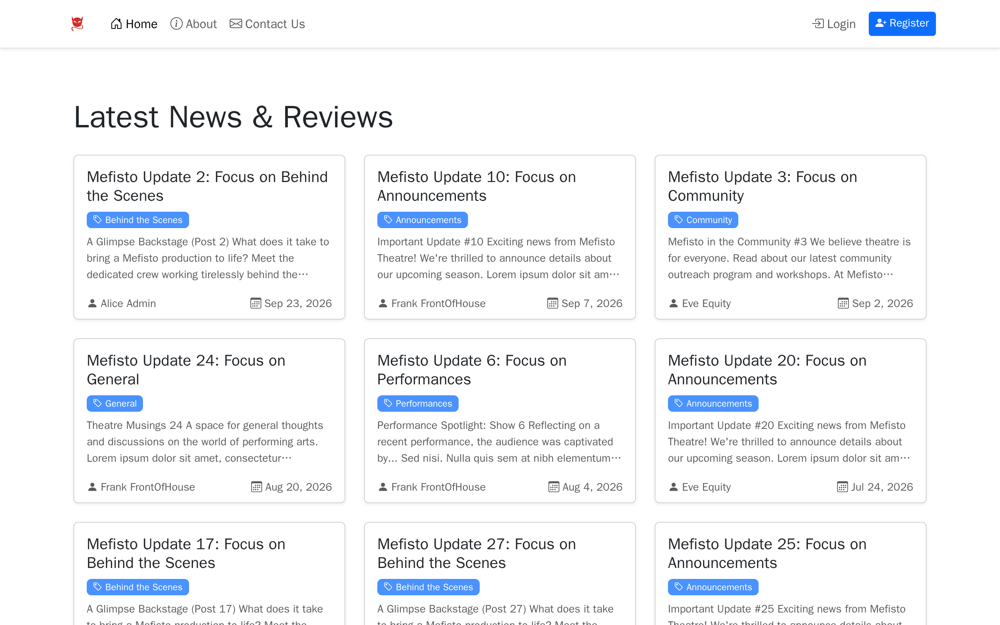
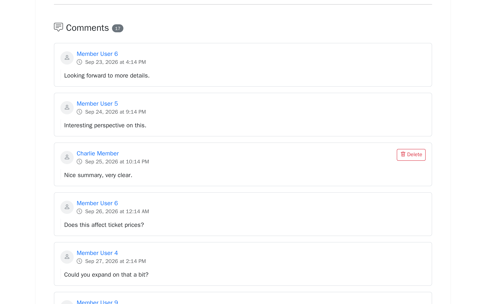
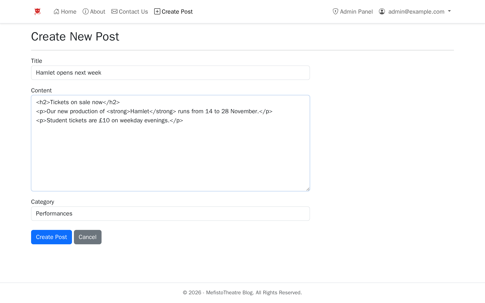
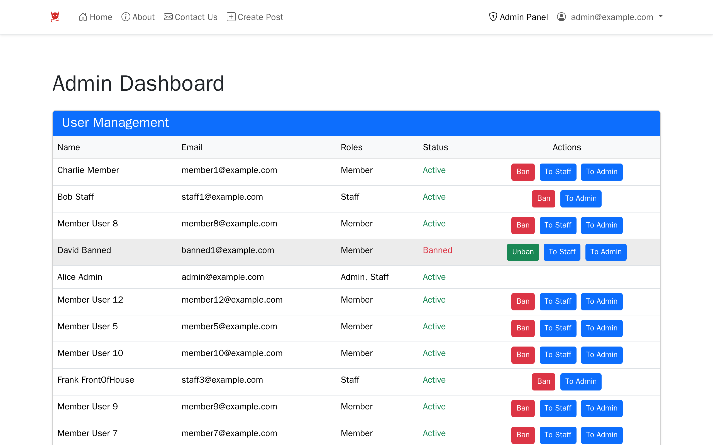

# Mefisto Theatre

[](https://github.com/OlehDzhumyk/mefisto-theatre/actions/workflows/build.yml)

A news and discussion site for a small theatre, built with ASP.NET Core MVC. Staff publish announcements,
reviews and behind-the-scenes posts; members comment on them; admins manage who can do what.

<table>
  <tr>
    <td></td>
    <td></td>
  </tr>
  <tr>
    <td align="center">Latest posts</td>
    <td align="center">Comments (members can delete their own)</td>
  </tr>
  <tr>
    <td></td>
    <td></td>
  </tr>
  <tr>
    <td align="center">Writing a post</td>
    <td align="center">Admin: roles and bans</td>
  </tr>
</table>

## Features

- **Posts** with categories, a paged home page and a category filter. Staff can create a new category
  straight from the post form.
- **Comments** for signed-in members. Members can delete their own comments, while staff and admins can
  delete any comment.
- **Three roles:** Member, Staff and Admin, using ASP.NET Core Identity. Members comment, staff write and
  moderate, and admins promote users and ban or unban them. A banned user can still read but can't comment.
- **Safe HTML in posts.** Posts can use basic formatting (headings, paragraphs, bold). Each post is run
  through [HtmlSanitizer](https://github.com/mganss/HtmlSanitizer) before it is rendered, so a
  `<script>` tag or an `onclick` attribute never reaches the page. The home page shows plain-text excerpts.
- **Account security:** 8-character minimum passwords, lockout after 5 failed logins, antiforgery tokens
  on every form, and proper 403 and 404 pages.
- **Demo data:** on first start the app creates the roles, 17 users, 30 posts and roughly 400 comments.

## Running it

The quickest way is Docker. It starts SQL Server 2022 and the app, applies the migrations and seeds the demo data:

```bash
git clone https://github.com/OlehDzhumyk/mefisto-theatre.git
cd mefisto-theatre
docker compose up --build
```

Open http://localhost:8080. On Apple Silicon, SQL Server runs under emulation, so the first start takes a minute.

To run it from source instead, you need the [.NET 10 SDK](https://dotnet.microsoft.com/download) and a SQL Server
instance. Set `ConnectionStrings:DefaultConnection` in
[`appsettings.json`](O_Dzhumyk_MefistoTheatre/appsettings.json) (it defaults to Windows LocalDB), then run
`dotnet run --project O_Dzhumyk_MefistoTheatre`.

### Demo accounts

| Role   | Email               | Password   |
|--------|---------------------|------------|
| Admin  | admin@example.com   | Admin@123  |
| Staff  | staff1@example.com  | Staff@123  |
| Member | member1@example.com | Member@123 |
| Banned | banned1@example.com | Banned@123 |

## Tests

```bash
dotnet test
```

There are 38 xUnit tests:

- **Unit tests** check the HTML sanitising and excerpt logic.
- **Integration tests** start the whole app with `WebApplicationFactory`, using in-memory SQLite in place of
  SQL Server. They drive it the way a browser would: open a page, take its antiforgery token, post the form.
  They cover:
  - who can open which page;
  - login, lockout and registration;
  - the category filter;
  - stripping scripts from posts;
  - who can comment and delete comments;
  - the admin actions.
- **Migration check:** one test fails if the EF Core model has changed without a matching migration.

GitHub Actions builds with warnings treated as errors, runs the tests and builds the Docker image on every push.

## Project structure

```
O_Dzhumyk_MefistoTheatre/
  Controllers/     Home (post list), Posts, Auth, Profile, Admin
  Data/            DbContext, migrations, demo data seeder
  Models/          Post, Comment, Category, User (extends IdentityUser)
  Services/        PostContentFormatter: sanitised HTML and plain-text excerpts
  ViewModels/      one per view
  Views/           Razor views (Bootstrap 5)
O_Dzhumyk_MefistoTheatre.Tests/   xUnit unit and integration tests
```

## What I'd do next

- Add a rich-text editor for posts. At the moment staff type raw HTML into a textarea.
- Add search, and show a post count next to each category.
- Add email confirmation and password reset. Identity supports both, but they need an email sender.

## Licence

[MIT](LICENSE)
